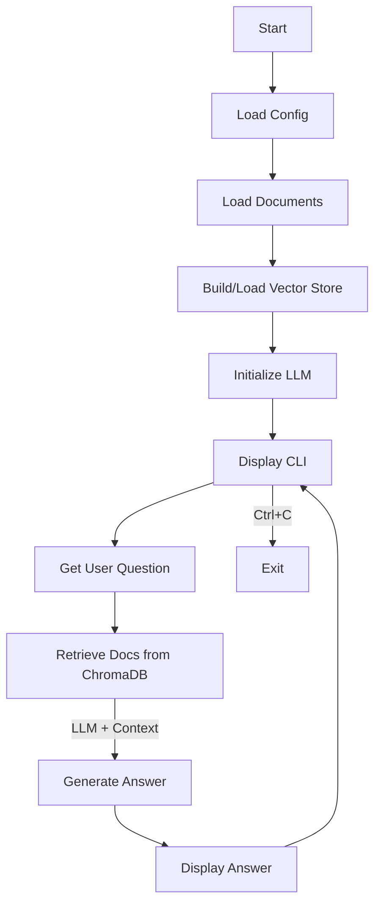

# RAG Pipeline

The Python script implements a Retrieval-Augmented Generation (RAG) pipeline using LangChain, Llama.cpp (via `llama-cpp-python`), and ChromaDB. It loads configuration from a `.env` file, supports PDF and TXT documents for context retrieval, and provides a command-line interface (CLI) for user interaction.

## Features

*   **Retrieval-Augmented Generation:** Answers questions based on provided documents.
*   **Local LLM:** Uses a locally downloaded Llama 2 model.
*   **Document Support:** Ingests PDF and TXT files from a specified directory. **Note:** PDF support requires the text to be selectable (no OCR capabilities).
*   **Vector Store:** Uses ChromaDB to store and retrieve document embeddings.
*   **Configurable:** Settings managed via a `.env` file.
*   **Automatic Model Download:** Downloads the specified model if it's not found locally.

## Motivation

This script was created to explore and experiment with Retrieval-Augmented Generation (RAG) pipelines using readily available open-source components. The goal was to build a simple, self-contained RAG system that runs entirely locally, leveraging the power of large language models (LLMs) like Llama 2 without relying on external APIs or cloud services. It serves as a practical example for understanding how to connect document loading, vector storage, and LLM inference for question-answering tasks based on custom knowledge sources.

## Setup

1.  **Clone the repository (if applicable):**
    ```bash
    git clone <your-repo-url>
    cd <your-repo-directory>
    ```

2.  **Create a Python virtual environment:**
    ```bash
    python -m venv rag_env
    source rag_env/bin/activate
    ```
    *(On Windows, use `rag_env\Scripts\activate`)*

3.  **Install dependencies:**
    ```bash
    pip install -r requirements.txt
    ```

## Configuration

Use the provided `.env` file to configure the necessary environment variables:


Key variables include:

*   `MODEL_FILENAME`: The filename of the model.
*   `MODEL_URL`: The URL to download the model from.
*   `MODELS_DIR`: (Optional) Directory to store models (defaults to `models`).
*   `LLM_TEMPERATURE`, `LLM_MAX_TOKENS`, `LLM_N_CTX`, `LLM_VERBOSE`: LLM parameters.
*   `EMBEDDING_MODEL_NAME`: Sentence Transformer model name.
*   `PERSIST_DIRECTORY`: (Optional) Directory for ChromaDB (defaults to `./chroma_db`).
*   `DOCS_DIRECTORY`: (Optional) Directory for documents (defaults to `./docs`).
*   `CHUNK_SIZE`, `CHUNK_OVERLAP`: Text splitting parameters.
*   `SEARCH_K`: (Optional) Number of documents to retrieve (defaults to 3).

*   Ensure the `MODEL_FILENAME` and `MODEL_URL` are set correctly for the desired model.
*   Place your PDF and TXT documents into the directory specified by `DOCS_DIRECTORY` (default is `./docs`). Create this directory if it doesn't exist.

## Usage

1.  **Activate the virtual environment:**
    ```bash
    source rag_env/bin/activate
    ```

2.  **Run the script:**
    ```bash
    python rag.py
    ```

3.  The script will:
    *   Download the model if it's missing and `MODEL_URL` is provided.
    *   Load documents from the `DOCS_DIRECTORY`.
    *   Build or load the ChromaDB vector store.
    *   Initialize the LLM.
    *   Start the interactive CLI.

4.  **Ask questions:** Type your question at the prompt and press Enter. The script will provide an answer based on the LLM and retrieved context (if documents were loaded).

5.  **Exit:** Press `Ctrl+C` to exit the script.

## Workflow Diagram



## Directory Structure

```
.
├── .env                # Configuration file (create this)
├── rag.py              # Main script
├── requirements.txt    # Python dependencies
├── docs/               # Directory for source documents (create this)
│   └── example.txt
└── models/             # Directory for downloaded models (created automatically)
    └── llama-2-7b-chat.Q4_K_M.gguf
 
```

## Dependencies

The project relies on the following major Python packages (see `requirements.txt` for full list):

*   `langchain`: Framework for building language model applications.
*   `llama-cpp-python`: Python bindings for llama.cpp.
*   `chromadb`: Vector database for embeddings.
*   `sentence-transformers`: For generating text embeddings.
*   `pypdf`: For loading PDF documents.
*   `requests`: For downloading the model.
*   `tqdm`: Progress bar for downloads.
*   `python-dotenv`: For loading environment variables.
